# Design Template State Management Flow

This diagram illustrates the state management flow for design templates, from initial loading to updates like selecting a new preview team.

## Mermaid Diagram

```mermaid
flowchart TB
    %% Initial Load Phase
    Server[("🗄️ Server<br/>(Supabase)")]
    Server -->|1. Fetch Template Data| ServerData["📦 Server Data<br/>• designTemplateId<br/>• canvasData (JSON)<br/>• designTemplateData<br/>• example_team"]

    %% Component Entry Point
    ServerData -->|2. Props to Component| Injector["⚛️ EditorDesignTemplateInject<br/>(Component)"]

    %% Store Initialization Phase
    Injector -->|3a. Initialize| DesignTemplateStore["📋 useDesignTemplateStore<br/>• storeDesignTemplateId<br/>• designTemplateData<br/>• isPublished<br/>• previewImageUrl"]

    Injector -->|3b. Initialize| CanvasStore["🎨 useCanvasStore<br/>• fabricCanvas<br/>• canvasWidth/Height<br/>• layers<br/>• isTemplateCanvasDataLoaded<br/>• selectedObject"]

    Injector -->|3c. Initialize| ExampleTeamsStore["👥 useExampleTeamsStore<br/>• availableTeams<br/>• savedExampleTeamValues<br/>• previewedExampleTeamValues<br/>• isOverlayOpen"]

    Injector -->|3d. Initialize| DynamicValuesStore["💎 useDynamicValuesStore<br/><b>savedValues:</b><br/>• name, jerseyNumber<br/>• teamName, teamLogoUrl<br/>• team colors<br/><b>previewValues:</b><br/>• (same structure)<br/>• isDirty flag"]

    %% Canvas Initialization
    CanvasStore -->|4. Create Canvas| FabricCanvas["🖼️ Fabric.js Canvas<br/>• Initialize with dimensions<br/>• Load from canvasData JSON"]

    FabricCanvas -->|5. Load Complete| CanvasStore
    CanvasStore -->|"setIsTemplateCanvasDataLoaded(true)"| LoadComplete["✅ Canvas Loaded"]

    %% Team Data Initialization
    ExampleTeamsStore -->|6a. Set from server| SavedTeam["💾 Saved Team<br/>(savedExampleTeamValues)"]
    ExampleTeamsStore -->|6b. Set initial preview| PreviewTeam["👁️ Preview Team<br/>(previewedExampleTeamValues)"]

    SavedTeam -->|7. Initialize Dynamic Values| DynamicValuesStore
    PreviewTeam -->|"_loadFromExampleTeam()"| DynamicValuesStore

    %% User Interaction - Select New Team
    style UserAction fill:#ff9800,stroke:#e65100,stroke-width:3px,color:#000
    UserAction["🖱️ USER ACTION<br/>Select New Team"]
    UserAction -->|8. Click team| TeamSelector["📱 ExampleTeamSection<br/>(Component)"]

    TeamSelector -->|9. handleTeamSelect| SelectFlow["🔄 Selection Flow"]

    %% Selection Flow Details
    SelectFlow -->|9a. selectTeamForPreview| ExampleTeamsStore
    ExampleTeamsStore -->|Update| PreviewTeam2["👁️ previewedExampleTeamValues<br/>= new team"]

    SelectFlow -->|9b. _loadFromExampleTeam| DynamicValuesStore
    DynamicValuesStore -->|Update| PreviewValues["🔄 previewValues<br/>• teamName<br/>• selectedTeamId<br/>• teamLogoUrl<br/>• teamPrimaryColor<br/>• teamSecondaryColor<br/>• teamTertiaryColor<br/><b>isDirty = true</b>"]

    SelectFlow -->|9c. applyTeamToCanvas| FabricCanvas
    FabricCanvas -->|"Apply colors & render"| CanvasRender["🎨 Canvas Re-renders<br/>with new team colors"]

    %% Save Flow
    style SaveAction fill:#4caf50,stroke:#2e7d32,stroke-width:3px,color:#fff
    SaveAction["💾 USER ACTION<br/>Save Team Selection"]
    SaveAction -->|10. handleConfirmSelectedTeam| SaveFlow["💾 Save Flow"]

    SaveFlow -->|10a. executeSaveDefaultTeam| ServerAction["📡 Server Action<br/>Save to Database"]
    ServerAction -->|10b. On Success| ApplyPreview["✅ _applyPreviewValues()"]

    ApplyPreview -->|10c. Commit Changes| DynamicValuesStore
    DynamicValuesStore -->|Update| SavedValues["💾 savedValues<br/>= previewValues<br/><b>isDirty = false</b>"]

    SavedValues -->|10d. Update| ExampleTeamsStore
    ExampleTeamsStore -->|"updateSavedTeam()"| SavedTeam2["💾 savedExampleTeamValues<br/>= new team"]

    %% Discard Flow (Alternative)
    style DiscardAction fill:#f44336,stroke:#c62828,stroke-width:3px,color:#fff
    DiscardAction["❌ USER ACTION<br/>Discard Changes"]
    DiscardAction -->|"_discardPreviewValues()"| DynamicValuesStore
    DynamicValuesStore -->|Revert| RevertValues["⏮️ previewValues<br/>= savedValues<br/><b>isDirty = false</b>"]

    RevertValues -->|Apply to Canvas| FabricCanvas

    %% Store Relationships
    subgraph StoreEcosystem["🏪 State Management Ecosystem"]
        DesignTemplateStore
        CanvasStore
        ExampleTeamsStore
        DynamicValuesStore
        EditorStore["🎛️ useEditorStore<br/>• UI state<br/>• sidebar visibility<br/>• zoom scale"]
    end

    %% Legend
    subgraph Legend["📚 Legend"]
        L1["🗄️ Server/Database"]
        L2["⚛️ React Component"]
        L3["🏪 Zustand Store"]
        L4["🎨 Canvas/Rendering"]
        L5["🖱️ User Interaction"]
        L6["💾 Saved State"]
        L7["👁️ Preview State"]
    end

    style StoreEcosystem fill:#e3f2fd,stroke:#1976d2,stroke-width:2px
    style Legend fill:#f5f5f5,stroke:#9e9e9e,stroke-width:1px,stroke-dasharray: 5 5
```



## Key State Management Concepts

### 1. **Store Separation of Concerns**

- **useDesignTemplateStore**: Template metadata (ID, publication status, preview image)
- **useCanvasStore**: Fabric.js canvas state, layers, dimensions, save status
- **useDynamicValuesStore**: User and team input values with preview/saved separation
- **useExampleTeamsStore**: Available teams, saved team, previewed team
- **useEditorStore**: UI state (sidebars, zoom, panning)

### 2. **Preview vs Saved Pattern**

The `useDynamicValuesStore` implements a sophisticated preview pattern:

```typescript
interface DynamicValuesStoreState {
  savedValues: DynamicValues; // ← From database
  previewValues: DynamicValues; // ← User is editing
  isDirty: boolean; // ← previewValues !== savedValues
}
```

**Benefits:**

- Users can preview changes without committing
- Easy to discard/revert changes
- Clear separation between persisted and temporary state
- Enables "Save" / "Discard" workflows

### 3. **Data Flow**

1. **Load**: Server → Stores → Canvas
2. **Preview**: User Input → Preview Values → Canvas (temporary)
3. **Save**: Preview Values → Server → Saved Values
4. **Discard**: Saved Values → Preview Values (revert)

### 4. **State Synchronization**

When selecting a new team:

1. `selectTeamForPreview()` - Updates ExampleTeamsStore
2. `_loadFromExampleTeam()` - Updates DynamicValuesStore preview values
3. `applyTeamToCanvas()` - Renders changes on canvas
4. User confirms → `executeSaveDefaultTeam()` - Saves to server
5. On success → `_applyPreviewValues()` - Commits preview to saved

### 5. **Canvas Change Tracking**

The canvas maintains its own dirty state:

- Tracks JSON state after each modification
- Compares current state with last saved state
- Updates `isCanvasSaved` flag
- Independent from DynamicValuesStore dirty tracking

## State Initialization Sequence

```
1. Component mounts with server data
2. Stores initialized with default values
3. Server data injected into stores
4. Canvas created and initialized
5. Canvas data loaded from JSON
6. Example team data set (if available)
7. Dynamic values initialized from team
8. Canvas render complete
9. Change tracking enabled
10. Ready for user interaction
```

## Critical State Transitions

### Team Selection Flow

```
User clicks team
  → ExampleTeamsStore.previewedExampleTeamValues updated
  → DynamicValuesStore.previewValues updated
  → Canvas re-renders with new colors
  → isDirty = true
  → Save button enabled
```

### Save Flow

```
User clicks save
  → Server action triggered
  → Database updated
  → On success:
    → DynamicValuesStore.savedValues = previewValues
    → ExampleTeamsStore.savedExampleTeamValues updated
    → isDirty = false
    → Save button disabled
```

### Discard Flow

```
User clicks discard
  → DynamicValuesStore.previewValues = savedValues
  → Canvas reverts to saved state
  → isDirty = false
  → Save button disabled
```

## Store Technologies

- **Zustand**: All stores use Zustand for state management
- **Persist Middleware**: Some stores (like useEditorStore in older version) use persist for localStorage
- **No Redux**: Simple, performant Zustand stores
- **Minimal Boilerplate**: Direct state updates, no actions/reducers

## Performance Considerations

- **Fabric.js Canvas**: Heavy rendering operations debounced
- **Store Updates**: Minimal re-renders with Zustand selectors
- **Preview Pattern**: Changes applied locally before server round-trip
- **Change Tracking**: Debounced canvas state comparison (100ms delay)
